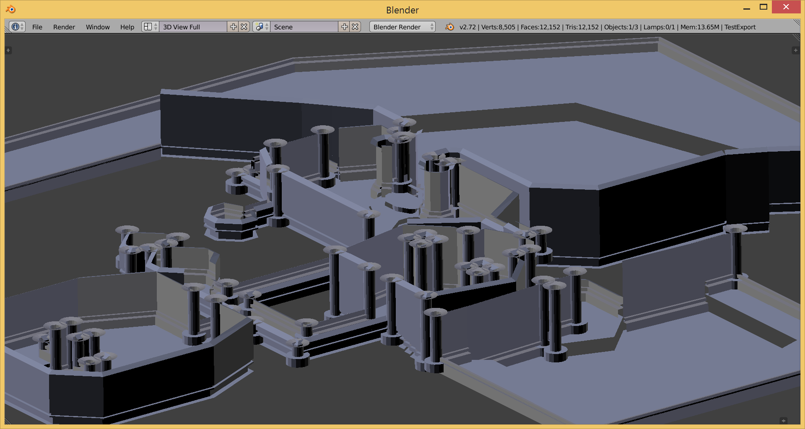

# Urho3D ProcGeom
**NOTE:** Image and Drawable only contain one addition each, DrawLine and WriteGeometryToOBJ.

Procedural geometry utilities for Urho3D.

- Lathe
  - ParShapes based surface of revolution
- Loft
  - Extrude a 2d profile through a series of oriented points
  - No caps
- Spine Loft 
  - Assumes the natural up axis is Y
  - `anchor to zero` for caps
- Carve CSG
  - Helpers for one-off add / subtract / intersect
  - UDIM-like UV coordinate offsets for texture-array packing
- Misc Tools
  - Anchoring a list of points to a range
    - Split 50/50 adjust to floor and ceiling
    - Anchor to ceiling (crown-molding)
    - Anchor to floor (base-boards / floor-trim)
  - Render UV layout to Image
    - Only change in `Image.h` / `Image.cpp`
  - Compile static shadow-geometry
    - Merged and reduced to canonicals only
  - Write list of `Geometry` to OBJ
    - Only change in `Drawable.h` / `Drawable.cpp`
  - `CalculateNormals` like the existing calculate tangents

## Example Output

Here the UDMF data for Doom2 MAP01 has been refined using spine-lofts along the walls and lathe objects on corners exceeding a threshold to insert columns.

Changing the 2d profiles used for either quickly changes the feel of the refined mesh.

## Dependencies

- Carve
- ParShapes (for lathe)
  - Used for merge colocals in the lathe function
- LibIGL
  - Not strict until Laplacian processes are fully ported over
- Eigen
  - For LibIGL

## Works in progress

- Laplacian deformation
  - Need to port over from MathGeoLib dependent version
- Bone-glow automatic weights
  - Need to port over from MathGeoLib dependent version
- Auto UVs
- CGA-like volume grammar
  - sorting out license issues

